# Restaurant POS & Management System - Class Diagram

This document describes the Class Diagram for the Restaurant POS & Management System, derived from the use case specifications in [usecase.md](file:///home/phamvanvuhoan/Documents/SE%20project/se_project/usecase.md).

## Mermaid Class Diagram

```mermaid
classDiagram
    %% Core User & Authentication
    class User {
        +int id
        +String name
        +String email
        +String password
        +String role
        +login(email, password) bool
        +logout() void
    }
    
    class Staff {
        +viewMenu(menu: Menu)
        +checkTableAvailability(table: Table) bool
        +assignTable(table: Table, order: DineInOrder)
        +createOrder(order: Order)
        +addItemToOrder(order: Order, item: MenuItem, qty: int)
        +manageOrder(order: Order)
        +processPayment(order: Order, payment: Payment) bool
    }
    
    class Manager {
        +manageMenu(menu: Menu)
        +createDailyMenu(menu: Menu)
        +createPromotion(promo: Promotion)
        +manageMembership(customer: Customer)
        +viewReport(type: String) Report
    }
    
    User <|-- Staff
    Staff <|-- Manager

    %% Table Management
    class Table {
        +String tableId
        +String tableNumber
        +String zone
        +int capacity
        +TableStatus status
        +reserve() void
        +release() void
        +assignToOrder(orderId: String) void
        +checkAvailability() bool
        +autoReleaseTable() void
    }
    
    class TableStatus {
        <<enumeration>>
        AVAILABLE
        OCCUPIED
        RESERVED
    }
    
    Table --> TableStatus

    %% Menu Management
    class Menu {
        +List~MenuItem~ items
        +addItem(item: MenuItem) void
        +removeItem(item: MenuItem) void
        +updateMenu(item: MenuItem) void
        +createDailyMenu() void
        +suggestDishes(order: Order) List~MenuItem~
    }
    
    class MenuItem {
        +int id
        +String name
        +double price
        +String image
        +Category category
        +updatePrice(newPrice: double) void
        +updateDetails(name: String, image: String, cat: Category) void
    }
    
    class Category {
        +String id
        +String name
        +String icon
    }
    
    Menu "1" *-- "*" MenuItem
    MenuItem "*" --> "1" Category

    %% Order Management
    class Order {
        +String id
        +Customer customer
        +List~OrderItem~ items
        +double total
        +OrderStatus status
        +Date createdAt
        +Payment payment
        +Promotion promotion
        +addItem(item: MenuItem, qty: int) void
        +removeItem(item: MenuItem) void
        +calculateTotal() double
        +applyPromotion(promo: Promotion) bool
        +setOrderStatus(status: OrderStatus) void
    }
    
    class DineInOrder {
        +Table table
        +assignTable(table: Table) void
    }
    
    class TakeawayOrder {
        +Date pickupTime
    }
    
    class OrderItem {
        +MenuItem menuItem
        +int quantity
        +getSubtotal() double
    }
    
    class OrderStatus {
        <<enumeration>>
        PENDING
        PREPARING
        READY
        SERVED
        CANCELLED
    }
    
    Order <|-- DineInOrder
    Order <|-- TakeawayOrder
    Order "1" *-- "*" OrderItem
    Order --> OrderStatus
    OrderItem "*" --> "1" MenuItem
    DineInOrder "1" --> "1" Table

    %% Customer & Membership
    class Customer {
        +String id
        +String name
        +String phoneNumber
        +int points
        +Membership membership
        +earnPoints(amount: double) void
        +usePoints(amount: int) void
    }
    
    class Membership {
        +MembershipLevel level
        +double discountRate
        +checkMembershipRule(customer: Customer) bool
    }
    
    class MembershipLevel {
        <<enumeration>>
        BRONZE
        SILVER
        GOLD
    }
    
    Customer "1" --> "0..1" Membership
    Membership --> MembershipLevel
    Order "0..1" --> "0..1" Customer

    %% Payment System
    class Payment {
        +String paymentId
        +double amount
        +Date paymentDate
        +PaymentStatus status
        +process() bool
    }
    
    class CashPayment {
        +double cashReceived
        +double changeGiven
        +process() bool
    }
    
    class CardPayment {
        +String cardNumber
        +String cardType
        +String transactionId
        +process() bool
    }
    
    class PointPayment {
        +int pointsRedeemed
        +process() bool
    }
    
    class PaymentStatus {
        <<enumeration>>
        PENDING
        COMPLETED
        FAILED
        REFUNDED
    }
    
    Payment <|-- CashPayment
    Payment <|-- CardPayment
    Payment <|-- PointPayment
    Payment --> PaymentStatus
    Order "1" --> "1" Payment

    %% Promotions
    class Promotion {
        +String id
        +String code
        +double discountValue
        +Date startDate
        +Date endDate
        +List~PromotionRule~ rules
        +isValid(order: Order) bool
        +apply(order: Order) void
    }
    
    class PromotionRule {
        +String ruleId
        +String conditions
        +checkRule(order: Order) bool
        +addComplimentaryToy(order: Order) void
    }
    
    Promotion "1" *-- "*" PromotionRule
    Order "0..1" --> "0..1" Promotion

    %% Reports & Analytics
    class Report {
        +String reportId
        +Date generatedAt
        +double totalRevenue
        +int totalOrders
        +List~MenuItem~ popularItems
        +generateDailyReport() void
    }
    
    Manager --> Report : generates
```

## Detailed Class Descriptions

### 1. Actor & User Classes
* **User**: Base class containing security, authentication credentials (`email`, `password`), and user profile details.
* **Staff**: Inherits from `User`. Models the restaurant staff responsible for table allocation, checking availability, placing orders, adding items to active orders, and processing payments.
* **Manager**: Inherits from `Staff`. Models managers who have elevated permissions for menu adjustments (creating daily menus), configuring promotion campaigns, managing loyalty programs, and generating dashboard analytics reports.

### 2. Table & Reservation Classes
* **Table**: Stores state details for tables (e.g., ID, number, zone, seating capacity, and current status: `Available`, `Occupied`, `Reserved`). Implements automated table release logic (`autoReleaseTable`) and table assignment routines.

### 3. Menu & Product Classes
* **Menu**: Central catalog aggregator holding active `MenuItem` definitions. Performs item additions/deletions, daily menu initialization, and a dish recommendation system (`suggestDishes`).
* **MenuItem**: Models individual items sold on the menu, tracking ID, name, price, and category.
* **Category**: Simple classifier tag (e.g., Burgers, Pizzas, Drinks, Desserts) for filtering and sorting menus.

### 4. Ordering & Cart Classes
* **Order**: Abstract base representation of a transaction cart. Keeps track of customer reference, collection of order items, totals, status (e.g., Pending, Preparing, Ready, Served, Cancelled), and links to applied promotions and payments.
* **DineInOrder**: Extends `Order` to represent in-house service. Captures table linkage (`Table`).
* **TakeawayOrder**: Extends `Order` to represent takeaway orders, tracking pickup schedules.
* **OrderItem**: Quantified reference of a `MenuItem` added to a specific order, calculating sub-totals.

### 5. Customer & Loyalty Classes
* **Customer**: Holds client profiles, names, contact numbers, and loyalty points.
* **Membership**: Defines loyalty tiers (Bronze, Silver, Gold) and tier-based discounts. Applies checks (`checkMembershipRule`) to validate loyalty rules.

### 6. Payment Processing
* **Payment**: Base template tracking transactions, financial amounts, timestamps, and validation status.
* **CashPayment**: Extends `Payment` for handling cash receipt and calculating change.
* **CardPayment**: Extends `Payment` for recording credit/debit card metadata (transaction IDs, network provider type).
* **PointPayment**: Extends `Payment` to pay via accumulated customer points.

### 7. Promotion System
* **Promotion**: Holds promotional configurations, discount values, applicability windows, and list of business rules.
* **PromotionRule**: Models validation rules for applying coupons and rewards (such as attaching complimentary items like toys).

### 8. Analytics & Reports
* **Report**: Compiles and aggregates sales data, transaction volume, and product popularity for management oversight.
