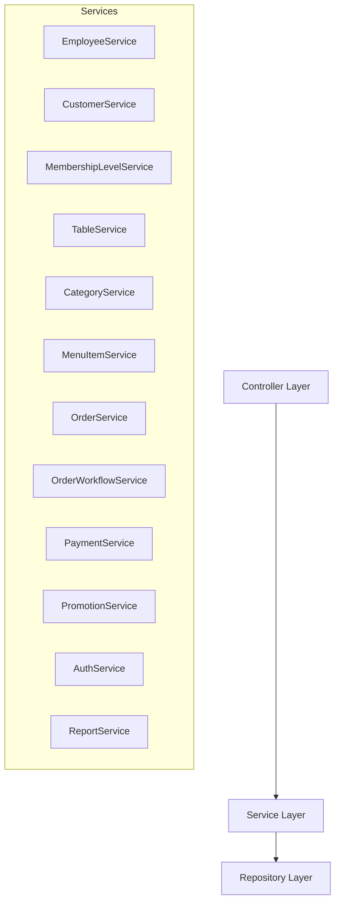

# Revised Implementation Plan - REST API Layer Design

This plan outlines the architecture, package structure, and endpoint mapping matrix for the REST API controllers and newly introduced feature CRUD services of the Restaurant POS backend.

## User Review Required

> [!IMPORTANT]
> To comply with the strict separation of concerns, **no controller will access repositories directly**. New service interfaces and implementations will be introduced for Employee, Customer, MembershipLevel, Table, Category, MenuItem, Promotion, Auth, and Reports.

> [!WARNING]
> **MembershipLevel deactivation removed.** Membership levels are system configuration entities and cannot currently be deactivated because the schema does not support lifecycle status management (`is_active` column does not exist on `membership_levels`). The `PATCH /membership-levels/{id}/deactivate` endpoint has been removed entirely from the design.

> [!CAUTION]
> **Category deletion is guarded by referential integrity.** Before physically deleting a category, the service must check whether any `MenuItem` references it. If at least one reference exists the request must be rejected with `HTTP 409 Conflict` and a `BusinessRuleViolationException` with message *"Cannot delete category because menu items are assigned to it."* Only when zero references exist is a `204 No Content` response returned.

---

## Revised Service Architecture Diagram

---

## Complete REST Endpoint Matrix (Revised)

| Controller | HTTP Method | Endpoint Path | Request Payload / Params | Status Code | Description |
| :--- | :--- | :--- | :--- | :--- | :--- |
| **Auth** | `POST` | `/api/v1/auth/login` | `LoginRequest` (Body) | `200 OK` | Authenticate & return token |
| **Employee** | `GET` | `/api/v1/employees` | Pageable (page, size, sort) | `200 OK` | List employees (paginated, sorted) |
| | `GET` | `/api/v1/employees/{id}` | Path variable `id` | `200 OK` | Get employee details |
| | `POST` | `/api/v1/employees` | `CreateEmployeeRequest` (Body) | `201 Created` | Create new employee |
| | `PUT` | `/api/v1/employees/{id}` | `UpdateEmployeeRequest` (Body) | `200 OK` | Update employee profile |
| | `PATCH` | `/api/v1/employees/{id}/change-password` | `ChangePasswordRequest` (Body) | `200 OK` | Change employee password |
| | `DELETE` | `/api/v1/employees/{id}` | Path variable `id` | `204 No Content` | Disable employee (Soft delete) |
| **Customer** | `GET` | `/api/v1/customers` | Pageable, `keyword` (Query) | `200 OK` | List customers / search by phone/name |
| | `GET` | `/api/v1/customers/{id}` | Path variable `id` | `200 OK` | Get customer details |
| | `POST` | `/api/v1/customers` | `CreateCustomerRequest` (Body) | `201 Created` | Create new customer |
| | `PUT` | `/api/v1/customers/{id}` | `UpdateCustomerRequest` (Body) | `200 OK` | Update customer info |
| **MembershipLevel**| `GET` | `/api/v1/membership-levels` | Pageable | `200 OK` | List membership levels |
| | `GET` | `/api/v1/membership-levels/{id}`| Path variable `id` | `200 OK` | Get membership level details |
| | `POST` | `/api/v1/membership-levels` | `CreateMembershipLevelRequest` (Body) | `201 Created` | Create new level |
| | `PUT` | `/api/v1/membership-levels/{id}`| `UpdateMembershipLevelRequest` (Body) | `200 OK` | Update level benefits |

| **Table** | `GET` | `/api/v1/tables` | Pageable, `status` (Query) | `200 OK` | List tables / filter by status |
| | `GET` | `/api/v1/tables/{id}` | Path variable `id` | `200 OK` | Get table details |
| | `POST` | `/api/v1/tables` | `CreateTableRequest` (Body) | `201 Created` | Create table |
| | `PUT` | `/api/v1/tables/{id}` | `UpdateTableRequest` (Body) | `200 OK` | Update table |
| | `PATCH` | `/api/v1/tables/{id}/status` | `TableStatusUpdateRequest` (Body) | `200 OK` | Change table status |
| | `DELETE` | `/api/v1/tables/{id}` | Path variable `id` | `204 No Content` | Delete table |
| **Category** | `GET` | `/api/v1/categories` | Pageable | `200 OK` | List categories |
| | `GET` | `/api/v1/categories/{id}` | Path variable `id` | `200 OK` | Get category details |
| | `POST` | `/api/v1/categories` | `CreateCategoryRequest` (Body) | `201 Created` | Create category |
| | `PUT` | `/api/v1/categories/{id}` | `UpdateCategoryRequest` (Body) | `200 OK` | Update category |
| | `DELETE` | `/api/v1/categories/{id}` | Path variable `id` | `204 No Content` / `409 Conflict` | Delete category — `409` if MenuItems reference it; `204` if safe to delete |
| **MenuItem** | `GET` | `/api/v1/menu-items` | Pageable, `categoryId`, `isActive` | `200 OK` | List/search menu items |
| | `GET` | `/api/v1/menu-items/{id}` | Path variable `id` | `200 OK` | Get item details |
| | `POST` | `/api/v1/menu-items` | `CreateMenuItemRequest` (Body) | `201 Created` | Create menu item |
| | `PUT` | `/api/v1/menu-items/{id}` | `UpdateMenuItemRequest` (Body) | `200 OK` | Update menu item |
| | `DELETE` | `/api/v1/menu-items/{id}` | Path variable `id` | `204 No Content` | Disable menu item (Soft delete) |
| **Order** | `GET` | `/api/v1/orders` | Pageable, `status` (Query) | `200 OK` | List orders |
| | `GET` | `/api/v1/orders/{id}` | Path variable `id` | `200 OK` | Get order details |
| | `POST` | `/api/v1/orders` | `CreateOrderRequest` (Body) | `201 Created` | Create order (cart) |
| | `POST` | `/api/v1/orders/{id}/items` | `AddOrderItemRequest` (Body) | `200 OK` | Add item to order |
| | `PUT` | `/api/v1/orders/{id}/items/{itemId}` | `UpdateOrderItemRequest` (Body) | `200 OK` | Update item quantity |
| | `DELETE` | `/api/v1/orders/{id}/items/{itemId}` | Path variable IDs | `200 OK` | Remove item from order |
| | `POST` | `/api/v1/orders/{id}/redeem-points` | `ApplyPointsRequest` (Body) | `200 OK` | Apply customer points discount |
| | `POST` | `/api/v1/orders/{id}/transition` | `OrderStatusTransitionRequest` (Body) | `200 OK` | Transition order status |
| | `POST` | `/api/v1/orders/{id}/payments` | `ProcessPaymentRequest` (Body) | `201 Created` | Process payment for order |
| **Payment** | `GET` | `/api/v1/payments` | Pageable | `200 OK` | List payments |
| | `GET` | `/api/v1/payments/{id}` | Path variable `id` | `200 OK` | Get payment details |
| | `POST` | `/api/v1/payments/{id}/refund` | Path variable `id` | `200 OK` | Refund payment transaction |
| **Promotion** | `GET` | `/api/v1/promotions` | Pageable | `200 OK` | List promotions |
| | `GET` | `/api/v1/promotions/{id}` | Path variable `id` | `200 OK` | Get promotion details |
| | `POST` | `/api/v1/promotions` | `CreatePromotionRequest` (Body) | `201 Created` | Create event promotion campaign |
| | `PUT` | `/api/v1/promotions/{id}` | `UpdatePromotionRequest` (Body) | `200 OK` | Update campaign |
| | `PATCH` | `/api/v1/promotions/{id}/status`| `PromotionStatusUpdateRequest` (Body)| `200 OK` | Activate/Deactivate campaign |
| | `DELETE` | `/api/v1/promotions/{id}` | Path variable `id` | `204 No Content` | Soft delete (deactivate) promotion |
| **Report** | `GET` | `/api/v1/reports/revenue/daily` | `date` (Query parameter) | `200 OK` | View daily revenue statistics |
| | `GET` | `/api/v1/reports/revenue/monthly`| `month` (Query parameter) | `200 OK` | View monthly revenue statistics |
| | `GET` | `/api/v1/reports/dishes/top` | `from`, `to` (Query parameters) | `200 OK` | View top selling dishes |

---

## Proposed Changes

### [Service Layer Component]
New standard CRUD service interfaces and implementations will be added to encapsulate repository data access logic for Employee, Customer, MembershipLevel, Table, Category, MenuItem, Promotion, Auth, and Report features.

#### CategoryService — additional validation method
| Method | Signature | Purpose |
| :--- | :--- | :--- |
| `existsMenuItemsByCategoryId` | `boolean existsMenuItemsByCategoryId(UUID categoryId)` | Delegates to `MenuItemRepository` to check for referencing rows before deletion. Throws `BusinessRuleViolationException` (HTTP 409) if the result is `true`. |

#### MembershipLevelService — removed method
- `deactivateMembershipLevel(UUID id)` has been **removed**. The service interface will only expose: `findAll`, `findById`, `create`, `update`.

### [Controller Layer Component]
All new controllers mapping the endpoints listed above will be generated.

---

## Verification Plan
We will verify all controller signatures and class references are correct.
